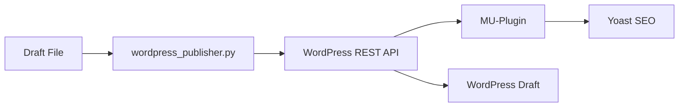

The `/publish-draft` command publishes draft articles to WordPress as drafts, automatically populating all SEO metadata fields.

## Usage

```bash
/publish-draft [filename] [--type post|page|custom]
```

<ParamField path="filename" type="string" required>
  Path to the draft file (in `drafts/` or `rewrites/`)
</ParamField>

<ParamField path="--type" type="string" default="post">
  Post type: `post` (blog post), `page` (WordPress page), or custom post type
</ParamField>

## Examples

<CodeGroup>
```bash Blog Post (default)
/publish-draft drafts/content-marketing-guide-2025-03-04.md
```

```bash WordPress Page
/publish-draft drafts/pricing-comparison.md --type page
```

```bash Custom Post Type
/publish-draft drafts/product-comparison.md --type compare
```
</CodeGroup>

## Post Types

<Tabs>
  <Tab title="post (default)">
    Standard blog post
    
    **Features**:
    - Supports categories and tags
    - Chronological feed
    - Author attribution
    - Published as draft by default
    
    **Use for**: Blog articles, news, tutorials
  </Tab>
  
  <Tab title="page">
    WordPress page
    
    **Features**:
    - No categories or tags
    - Not in chronological feed
    - Hierarchical (can have parent pages)
    - Published as draft by default
    
    **Use for**: Landing pages, about pages, product pages
  </Tab>
  
  <Tab title="Custom Post Types">
    Must be registered in WordPress with REST API support
    
    **Examples**:
    - `compare` - Product comparisons
    - `case-study` - Customer case studies
    - `resource` - Downloadable resources
    
    **Requirements**:
    - Custom post type must exist in WordPress
    - Must have `'show_in_rest' => true` in registration
  </Tab>
</Tabs>

## What It Does

<Steps>
  <Step title="Parses Draft File">
    Extracts all metadata from frontmatter:
    - Meta Title
    - Meta Description
    - Primary Keyword (Target Keyword)
    - Secondary Keywords
    - URL Slug
    - Categories
    - Tags
  </Step>
  
  <Step title="Converts Markdown to HTML">
    - Converts markdown formatting to HTML
    - Preserves headings (H1-H6)
    - Maintains links and formatting
    - Converts lists and code blocks
  </Step>
  
  <Step title="Creates WordPress Draft">
    Posts via REST API:
    - Status: `draft` (never auto-publishes)
    - Title: H1 from article
    - Content: Full HTML content
    - Slug: From frontmatter
    - Author: Current WordPress user
  </Step>
  
  <Step title="Sets Yoast SEO Fields">
    Automatically populates:
    - SEO Title (Meta Title)
    - Meta Description
    - Focus Keyphrase (Primary Keyword)
    - Canonical URL (if specified)
  </Step>
  
  <Step title="Assigns Taxonomy">
    If specified in frontmatter:
    - Categories (creates if don't exist)
    - Tags (creates if don't exist)
  </Step>
  
  <Step title="Returns Edit URL">
    Provides direct link to edit in WordPress admin
  </Step>
</Steps>

## Metadata Mapping

<Tabs>
  <Tab title="Content Fields">
    | Draft Field | WordPress Field |
    |-------------|----------------|
    | H1 Title | Post Title |
    | Body Content | Post Content (HTML) |
    | URL Slug | Post Slug |
  </Tab>
  
  <Tab title="Yoast SEO Fields">
    | Draft Field | Yoast Field |
    |-------------|-------------|
    | Meta Title | Yoast SEO Title |
    | Meta Description | Yoast Meta Description + Excerpt |
    | Target Keyword | Yoast Focus Keyphrase |
  </Tab>
  
  <Tab title="Taxonomy">
    | Draft Field | WordPress Taxonomy |
    |-------------|-------------------|
    | Category | Post Categories |
    | Tags | Post Tags |
  </Tab>
</Tabs>

## Setup Requirements

### Environment Variables

Add to `.env` file:

<CodeGroup>
```bash .env
WORDPRESS_URL=https://yoursite.com
WORDPRESS_USERNAME=your-username
WORDPRESS_APP_PASSWORD=xxxx-xxxx-xxxx-xxxx
```
</CodeGroup>

### Getting an Application Password

<Steps>
  <Step title="Log into WordPress Admin">
    Navigate to your WordPress dashboard
  </Step>
  
  <Step title="Go to Your Profile">
    Users > Your Profile
  </Step>
  
  <Step title="Scroll to Application Passwords">
    Find "Application Passwords" section at bottom
  </Step>
  
  <Step title="Create New Password">
    1. Enter name: "SEO Machine"
    2. Click "Add New Application Password"
    3. Copy the generated password
  </Step>
  
  <Step title="Add to .env">
    Paste into `WORDPRESS_APP_PASSWORD` in `.env` file
  </Step>
</Steps>

<Warning>
  **Security**: Application passwords are different from your WordPress login password. They can be revoked individually without changing your main password.
</Warning>

### WordPress Plugin

Install the Yoast SEO REST API MU-plugin:

<Steps>
  <Step title="Install MU-Plugin">
    Copy `wordpress/seo-machine-yoast-rest.php` to:
    ```
    wp-content/mu-plugins/seo-machine-yoast-rest.php
    ```
  </Step>
  
  <Step title="Add Functions Snippet">
    Add code from `wordpress/functions-snippet.php` to your theme's `functions.php`
  </Step>
  
  <Step title="Verify Installation">
    The plugin exposes Yoast SEO fields to the REST API
  </Step>
</Steps>

See `wordpress/README.md` for detailed setup instructions.

## Adding Categories & Tags

To assign categories or tags, add to draft frontmatter:

<CodeGroup>
```markdown Single Category
**Category**: Content Marketing
```

```markdown Multiple Categories/Tags
**Category**: Content Marketing, SEO
**Tags**: b2b saas, getting started, beginner guide
```
</CodeGroup>

<Info>
  Categories and tags are **created automatically** if they don't exist in WordPress.
</Info>

## Process

<Steps>
  <Step title="Validate File">
    Command confirms the draft file exists and parses metadata:
    
    ```bash
    ✓ Found file: drafts/content-marketing-guide-2025-03-04.md
    ✓ Parsed metadata
    ✓ Title: "Content Marketing Guide for B2B SaaS"
    ✓ Meta Title: "Content Marketing Guide: 15 Strategies | YourBrand"
    ✓ Target Keyword: "content marketing guide"
    ```
  </Step>
  
  <Step title="Publish to WordPress">
    Runs the WordPress publisher:
    
    ```bash
    python data_sources/modules/wordpress_publisher.py \
      "drafts/content-marketing-guide-2025-03-04.md" \
      --type post
    ```
  </Step>
  
  <Step title="Confirm Success">
    Displays WordPress edit URL:
    
    ```bash
    ✓ Published to WordPress (Draft)
    ✓ Post ID: 1234
    ✓ Edit URL: https://yoursite.com/wp-admin/post.php?post=1234&action=edit
    ```
  </Step>
</Steps>

## Output

Successful publish returns:

```markdown
## Publishing Summary

**Status**: ✓ Success
**Post Type**: post
**WordPress Status**: draft
**Post ID**: 1234
**Title**: Content Marketing Guide for B2B SaaS
**URL Slug**: /blog/content-marketing-guide
**Yoast SEO**: ✓ Configured
**Categories**: Content Marketing, SEO
**Tags**: b2b saas, guide

**Edit URL**: https://yoursite.com/wp-admin/post.php?post=1234&action=edit

**Next Steps**:
1. Review the draft in WordPress admin
2. Upload any images or media
3. Preview the post
4. Publish when ready
```

## Troubleshooting

<AccordionGroup>
  <Accordion title="WORDPRESS_URL must be set">
    **Problem**: Environment variables not configured
    
    **Solution**:
    1. Create `.env` file in root directory
    2. Add WordPress credentials:
       ```bash
       WORDPRESS_URL=https://yoursite.com
       WORDPRESS_USERNAME=your-username
       WORDPRESS_APP_PASSWORD=xxxx-xxxx-xxxx-xxxx
       ```
    3. Verify `.env` is in `.gitignore`
  </Accordion>
  
  <Accordion title="401 Unauthorized">
    **Problem**: Authentication failed
    
    **Solutions**:
    - Verify username is correct (not email)
    - Regenerate Application Password
    - Ensure user has permission to create posts
    - Check WordPress URL is correct (no trailing slash)
  </Accordion>
  
  <Accordion title="Could not find category">
    **Problem**: Category doesn't exist
    
    **Solution**: Categories are created automatically. If error persists:
    - Check category name for special characters
    - Manually create category in WordPress first
    - Verify REST API is enabled for categories
  </Accordion>
  
  <Accordion title="Yoast fields not populated">
    **Problem**: Yoast SEO REST API not exposed
    
    **Solution**:
    1. Install MU-plugin: `wordpress/seo-machine-yoast-rest.php`
    2. Verify Yoast SEO plugin is active
    3. Check `functions.php` snippet is added
    4. Test REST API endpoint: `/wp-json/wp/v2/posts`
  </Accordion>
  
  <Accordion title="Custom post type not found">
    **Problem**: Custom post type not registered or REST API not enabled
    
    **Solution**:
    1. Verify custom post type exists in WordPress
    2. Check registration includes `'show_in_rest' => true`
    3. Test endpoint: `/wp-json/wp/v2/[post-type]`
  </Accordion>
</AccordionGroup>

## Important Notes

<Warning>
  **Posts are created as DRAFTS**, never published automatically. Always review in WordPress before publishing.
</Warning>

<Info>
  **Images are NOT uploaded** - only text content is transferred. Upload images manually in WordPress after publishing.
</Info>

<Info>
  **Multiple runs create multiple drafts** - Running the command twice creates two separate draft posts.
</Info>

## WordPress Integration

SEO Machine uses the WordPress REST API with a custom MU-plugin for Yoast SEO integration.

### Architecture



### Files

<CardGroup cols={2}>
  <Card title="wordpress_publisher.py" icon="python">
    Python module that handles REST API calls
    
    Location: `data_sources/modules/wordpress_publisher.py`
  </Card>
  
  <Card title="seo-machine-yoast-rest.php" icon="wordpress">
    MU-plugin that exposes Yoast SEO fields to REST API
    
    Location: `wordpress/seo-machine-yoast-rest.php`
  </Card>
  
  <Card title="functions-snippet.php" icon="code">
    Additional theme functions for REST API support
    
    Location: `wordpress/functions-snippet.php`
  </Card>
  
  <Card title="README.md" icon="book">
    Detailed WordPress setup instructions
    
    Location: `wordpress/README.md`
  </Card>
</CardGroup>

## Tips

<CardGroup cols={2}>
  <Card title="Test First" icon="flask">
    Test with a simple article first to verify setup.
  </Card>
  
  <Card title="Review in WordPress" icon="eye">
    Always review and preview drafts before publishing live.
  </Card>
  
  <Card title="Upload Images" icon="image">
    Add images manually in WordPress after publishing draft.
  </Card>
  
  <Card title="Check Yoast" icon="check">
    Verify Yoast SEO fields populated correctly in WordPress.
  </Card>
</CardGroup>

## Related Commands

<CardGroup cols={2}>
  <Card title="/optimize" icon="wand-magic-sparkles" href="/commands/optimize">
    Optimize before publishing
  </Card>
  
  <Card title="/write" icon="pen-to-square" href="/commands/write">
    Create articles to publish
  </Card>
</CardGroup>