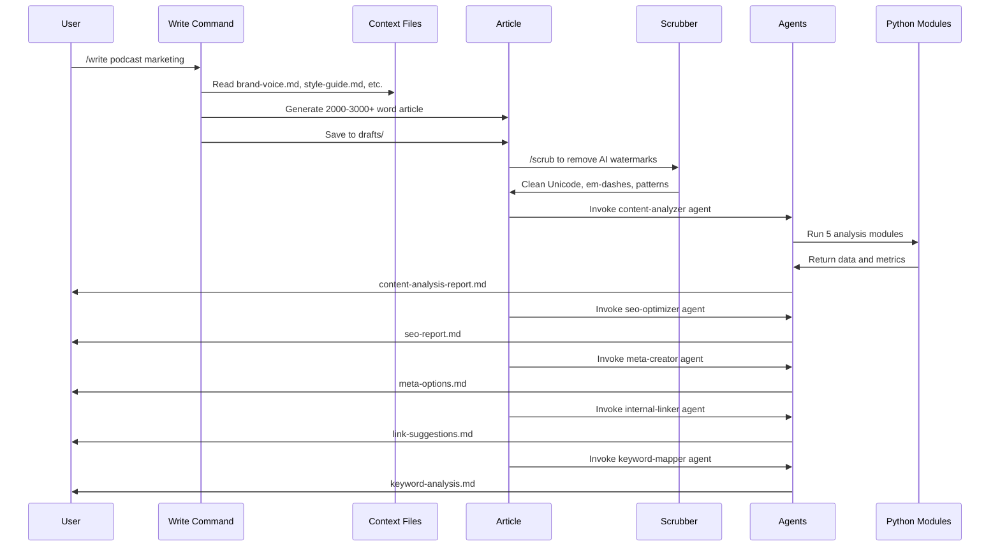

## Overview

SEO Machine is built on a **command-agent architecture** that separates workflow orchestration from specialized analysis. This design provides flexibility, modularity, and powerful automation for content creation.

## Architecture Components

### Command-Agent Model

The system has two primary layers:

1. **Commands** (`.claude/commands/`) - Orchestrate workflows and coordinate multiple operations
2. **Agents** (`.claude/agents/`) - Specialized roles that perform deep analysis and optimization

```
User → Command → Agent(s) → Analysis → Output
```

### Commands Layer

Commands are workflow orchestrators invoked as slash commands. They:

- Handle user input and parameters
- Read context files for configuration
- Execute Python scripts when needed
- Invoke specialized agents
- Manage file creation and organization
- Coordinate multi-step processes

**Core Commands:**

<CardGroup cols={2}>
  <Card title="/research" icon="magnifying-glass">
    Keyword and competitor research
  </Card>
  <Card title="/write" icon="pencil">
    Create SEO-optimized articles
  </Card>
  <Card title="/rewrite" icon="arrows-rotate">
    Update existing content
  </Card>
  <Card title="/optimize" icon="wand-magic-sparkles">
    Final SEO polish pass
  </Card>
</CardGroup>

**Command Location:** `~/workspace/source/.claude/commands/`

### Agents Layer

Agents are specialized roles with deep expertise in specific areas. They:

- Analyze completed content
- Provide actionable recommendations
- Generate scores and metrics
- Create alternative options (headlines, meta tags)
- Identify issues and opportunities

**Key Agents:**

| Agent | Purpose | Output |
|-------|---------|--------|
| **content-analyzer** | Comprehensive data-driven analysis using 5 Python modules | Analysis report with intent, keywords, length, readability, SEO scores |
| **seo-optimizer** | On-page SEO recommendations | SEO score (0-100) with specific improvements |
| **meta-creator** | Generate meta title/description variations | 5 options for each with recommendations |
| **internal-linker** | Strategic internal linking suggestions | 3-5 specific links with placement |
| **keyword-mapper** | Keyword placement and density analysis | Distribution map and gap analysis |
| **editor** | Transform technical content to human-sounding | Humanity score with specific edits |
| **performance** | Data-driven content prioritization | Priority queue with opportunity scores |

**Agent Location:** `~/workspace/source/.claude/agents/`

### Python Analysis Pipeline

The third architectural layer consists of Python modules that provide data-driven analysis:

**Location:** `~/workspace/source/data_sources/modules/`

#### Core SEO Analysis Modules

The Content Analyzer chains five specialized modules:

1. **search_intent_analyzer.py** - Classifies queries into informational, navigational, transactional, or commercial intent
2. **keyword_analyzer.py** - Calculates density, distribution, clustering, and detects keyword stuffing
3. **content_length_comparator.py** - Benchmarks word count against top 10-20 SERP results
4. **readability_scorer.py** - Flesch Reading Ease, grade level, sentence complexity
5. **seo_quality_rater.py** - Comprehensive 0-100 SEO score with category breakdowns

#### Data Integration Modules

- **google_analytics.py** - GA4 traffic and engagement data
- **google_search_console.py** - Rankings, impressions, and CTR
- **dataforseo.py** - SERP positions and keyword metrics
- **data_aggregator.py** - Combines all sources into unified analytics
- **wordpress_publisher.py** - Publishes to WordPress with Yoast SEO metadata

#### Opportunity Scoring

**opportunity_scorer.py** uses 8 weighted factors:

- Volume (25%)
- Position (20%)
- Intent (20%)
- Competition (15%)
- Cluster (10%)
- CTR (5%)
- Freshness (5%)
- Trend (5%)

#### CRO Analysis Modules

Landing page conversion optimization:

- **above_fold_analyzer.py** - Above-the-fold content analysis
- **cta_analyzer.py** - CTA effectiveness scoring
- **trust_signal_analyzer.py** - Trust signal detection
- **landing_page_scorer.py** - Overall landing page scoring (0-100)
- **landing_performance.py** - Performance tracking via GA4/GSC
- **cro_checker.py** - CRO best practices validation

## How Components Work Together

### Example: /write Command Flow

Here's how the architecture executes when you run `/write [topic]`:



### Automatic Agent Execution

After the `/write` command saves an article, it **automatically triggers** these agents in sequence:

1. Content Analyzer (comprehensive data-driven analysis)
2. SEO Optimizer (on-page SEO recommendations)
3. Meta Creator (meta element variations)
4. Internal Linker (strategic link suggestions)
5. Keyword Mapper (keyword placement analysis)

Each agent creates its own report file in the `drafts/` directory.

## Context System Integration

All commands and agents reference context files for configuration:

**Location:** `~/workspace/source/context/`

- **brand-voice.md** - Tone, messaging pillars, voice guidelines
- **style-guide.md** - Grammar, formatting, terminology standards
- **seo-guidelines.md** - Keyword density, structure requirements
- **internal-links-map.md** - Key pages for internal linking
- **features.md** - Product features and benefits
- **competitor-analysis.md** - Competitive intelligence
- **target-keywords.md** - Keyword research and topic clusters
- **writing-examples.md** - Example articles for style reference
- **cro-best-practices.md** - Conversion optimization guidelines

Commands reference these using `@context/filename.md` syntax in their instructions.

## Directory Structure

```
seomachine/
├── .claude/
│   ├── commands/          # Workflow orchestrators (19 commands)
│   ├── agents/           # Specialized analyzers (10 agents)
│   └── skills/           # Marketing skills (26 skills)
├── data_sources/
│   ├── modules/          # Python analysis modules (23 modules)
│   ├── config/           # API credentials (.env)
│   ├── utils/            # Helper functions
│   └── cache/            # Cached API responses
├── context/              # Brand guidelines and configuration (9 files)
├── topics/               # Raw content ideas
├── research/             # Research briefs
├── drafts/               # Work in progress
├── published/            # Final versions
├── rewrites/             # Updated content
├── landing-pages/        # Landing page content
└── audits/               # Audit reports
```

## Design Principles

### Separation of Concerns

- **Commands** handle workflow logic
- **Agents** provide specialized analysis
- **Python modules** deliver data-driven insights
- **Context files** store configuration

### Modularity

Each component is independent and replaceable:

- Add new commands without modifying existing ones
- Create new agents for specialized analysis
- Extend Python modules with new capabilities
- Update context files without code changes

### Automation

The architecture enables automatic execution:

- Agents run automatically after commands complete
- Python modules chain together for comprehensive analysis
- Quality scoring triggers automatic revisions
- Content flows through pipeline stages automatically

### Data-Driven Decision Making

Python modules provide objective metrics:

- Exact keyword density calculations
- Competitive benchmarking with SERP data
- Readability scores (Flesch, grade level)
- SEO quality ratings (0-100)
- Opportunity scoring for prioritization

## Extensibility

### Adding New Commands

Create a new `.md` file in `.claude/commands/`:

```markdown
# My Custom Command

Use this command to...

## Usage
/my-command [parameter]

## Process
- Step 1
- Step 2
```

### Adding New Agents

Create a new `.md` file in `.claude/agents/`:

```markdown
# My Custom Agent

You are an expert...

## Core Mission
Analyze content for...

## Analysis Process
1. ...
2. ...
```

### Adding New Python Modules

Create a new `.py` file in `data_sources/modules/`:

```python
def analyze_custom_metric(content, **kwargs):
    """Analyze custom metric."""
    # Analysis logic
    return {
        'score': score,
        'recommendations': recommendations
    }
```

## Performance Considerations

### Parallel Execution

Agents can run in parallel when invoked together:

```python
# Multiple agents execute simultaneously
invoke_agents(['seo-optimizer', 'meta-creator', 'keyword-mapper'])
```

### Caching

API responses are cached to improve performance:

**Location:** `data_sources/cache/`

- SERP data from DataForSEO
- Analytics data from GA4/GSC
- Competitor content

### Incremental Analysis

Python modules analyze only what's needed:

- Skip SERP fetching if data exists
- Reuse keyword analysis across agents
- Cache readability calculations

## Best Practices

### For Command Development

- Keep commands focused on workflow orchestration
- Delegate analysis to agents
- Use Python modules for data-heavy operations
- Reference context files for configuration
- Provide clear output to users

### For Agent Development

- Focus on single area of expertise
- Provide specific, actionable recommendations
- Use data from Python modules when available
- Generate reports in consistent format
- Prioritize issues by severity

### For Python Module Development

- Return structured data (dicts, not strings)
- Include error handling and validation
- Document parameters and return values
- Cache expensive API calls
- Provide confidence scores when applicable

<Info>
The command-agent architecture enables SEO Machine to be both powerful and maintainable, with clear separation between workflow orchestration, specialized analysis, and data processing.
</Info>