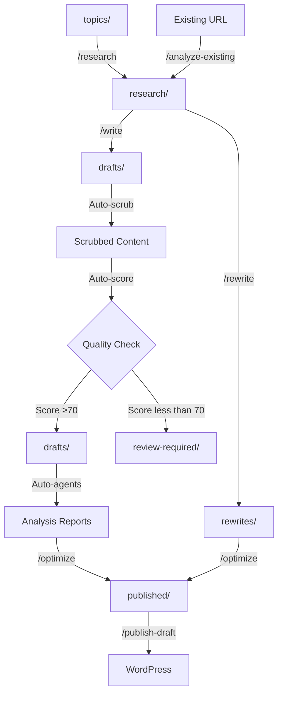
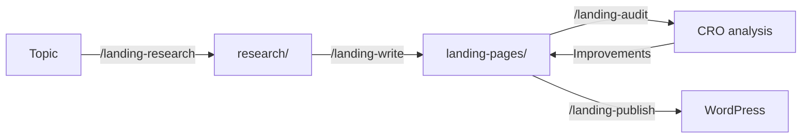

## Overview

The content pipeline is SEO Machine's structured approach to moving content from initial idea to published article. Each stage has specific quality gates, automatic processes, and output locations.

## Pipeline Stages



## Stage 1: Topics

**Directory:** `topics/`

**Purpose:** Capture raw content ideas and topic suggestions

**Format:** Free-form markdown files

**How to use:**

```markdown
# Content Ideas Q1 2026

## Podcast Marketing
- Podcast SEO strategies
- How to promote a new podcast
- Social media for podcasters

## Monetization
- Podcast sponsorship guide
- Premium content strategies
- Listener donations and crowdfunding
```

**Tip:** Organize by theme, quarter, or priority level

## Stage 2: Research

**Directory:** `research/`

**Purpose:** Store research briefs, SERP analysis, and content audits

**Commands that output here:**

- `/research [topic]` → `research/brief-[topic]-[date].md`
- `/analyze-existing [URL]` → `research/analysis-[topic]-[date].md`
- `/research-serp [keyword]` → `research/serp-[keyword]-[date].md`
- `/research-gaps` → `research/competitor-gaps-[date].md`
- `/research-trending` → `research/trending-[date].md`
- `/research-performance` → `research/performance-priorities-[date].md`

**Research Brief Contains:**

<Tabs>
  <Tab title="SEO Foundation">
    - Primary keyword (volume, difficulty)
    - Secondary keywords
    - Target word count
    - Featured snippet opportunity
    - Search intent classification
  </Tab>
  <Tab title="Competitive Analysis">
    - Top 3-10 competitor articles
    - Common themes/sections
    - Content gaps
    - Differentiation strategy
    - Domain authority landscape
  </Tab>
  <Tab title="Content Strategy">
    - Recommended outline (H1, H2, H3)
    - Supporting statistics
    - Example use cases
    - Internal linking opportunities
    - External sources to reference
  </Tab>
</Tabs>

**Quality Gate:** Research brief should be comprehensive enough to write without additional research

## Stage 3: Drafts

**Directory:** `drafts/`

**Purpose:** Work-in-progress articles and their analysis reports

**Commands that output here:**

- `/write [topic]` → Multiple files (see below)
- `/article [topic]` → Multiple files

**Output Files from /write:**

```
drafts/
├── podcast-marketing-2026-03-04.md              # Main article
├── content-analysis-podcast-marketing-2026-03-04.md  # Comprehensive analysis
├── seo-report-podcast-marketing-2026-03-04.md        # SEO recommendations
├── meta-options-podcast-marketing-2026-03-04.md      # Meta variations
├── link-suggestions-podcast-marketing-2026-03-04.md  # Internal linking
└── keyword-analysis-podcast-marketing-2026-03-04.md  # Keyword mapping
```

### Automatic Scrubbing

**Immediately after saving**, the article is automatically scrubbed to remove AI signatures:

```bash
# Automatic execution
/scrub drafts/podcast-marketing-2026-03-04.md
```

**What gets cleaned:**

- Invisible Unicode watermarks
- Zero-width spaces (U+200B)
- Byte order marks (BOM)
- Format-control characters
- Excessive em-dashes (replaced contextually)

**Output:**

```
✓ Unicode watermarks removed: 47
✓ Format-control characters removed: 12
✓ Em-dashes replaced: 23
✓ File cleaned successfully
```

### Automatic Quality Scoring

**After scrubbing**, content is automatically scored:

```python
# Runs automatically
python data_sources/modules/content_scorer.py drafts/[file].md
```

**Scoring Dimensions:**

| Dimension | Weight | Evaluation |
|-----------|--------|------------|
| **Humanity/Voice** | 30% | Checks for AI phrases, contractions, natural flow |
| **Specificity** | 25% | Looks for concrete examples, numbers, names, details |
| **Structure Balance** | 20% | Ensures 40-70% prose (not all lists/bullets) |
| **SEO Compliance** | 15% | Validates keywords, meta, links, structure |
| **Readability** | 10% | Flesch 60-70, grade 8-10, sentence length |

**Scoring Result:**

```json
{
  "composite_score": 72,
  "dimension_scores": {
    "humanity": 75,
    "specificity": 70,
    "structure": 68,
    "seo": 80,
    "readability": 77
  },
  "priority_fixes": [
    "Add 2-3 specific examples with real names/numbers",
    "Replace generic 'companies' with actual company names",
    "Add concrete statistics to support claims"
  ]
}
```

**Routing Decision:**

<CodeGroup>

```bash Score ≥70: Stay in drafts/
# Content passes quality threshold
# Proceed to agent execution
```

```bash Score less than 70: Move to review-required/
# After 2 revision attempts, if still less than 70:
mv drafts/article.md review-required/
# Creates review notes:
review-required/article_REVIEW_NOTES.md
```

</CodeGroup>

### Automatic Agent Execution

**If quality score ≥70**, five agents analyze the content:

<Steps>
  <Step title="Content Analyzer">
    Runs 5 Python analysis modules:
    
    - `search_intent_analyzer.py` - Intent classification
    - `keyword_analyzer.py` - Density, distribution, clustering
    - `content_length_comparator.py` - Benchmarks vs. SERP
    - `readability_scorer.py` - Flesch scores, grade level
    - `seo_quality_rater.py` - 0-100 SEO score
    
    **Output:** `drafts/content-analysis-[topic]-[date].md`
  </Step>
  
  <Step title="SEO Optimizer">
    Analyzes on-page SEO:
    
    - Keyword placement and density
    - Heading structure
    - Link strategy (internal/external)
    - Meta elements
    - Featured snippet opportunities
    
    **Output:** `drafts/seo-report-[topic]-[date].md`
  </Step>
  
  <Step title="Meta Creator">
    Generates variations:
    
    - 5 meta title options (50-60 chars)
    - 5 meta description options (150-160 chars)
    - Recommendations for each
    - SERP preview
    
    **Output:** `drafts/meta-options-[topic]-[date].md`
  </Step>
  
  <Step title="Internal Linker">
    Strategic linking:
    
    - Reviews internal-links-map.md
    - Identifies 3-5 relevant pages
    - Provides exact placement locations
    - Suggests anchor text
    
    **Output:** `drafts/link-suggestions-[topic]-[date].md`
  </Step>
  
  <Step title="Keyword Mapper">
    Keyword analysis:
    
    - Maps all keyword occurrences
    - Checks critical placements
    - Calculates density
    - Identifies gaps
    
    **Output:** `drafts/keyword-analysis-[topic]-[date].md`
  </Step>
</Steps>

**Agent Execution Time:** 2-3 minutes total

**Quality Gate:** All agent reports complete before proceeding to optimization

## Stage 4: Review Required

**Directory:** `review-required/`

**Purpose:** Content that needs human review before proceeding

**Triggers that route content here:**

- Quality score less than 70 after 2 revision attempts
- Critical SEO issues detected
- Keyword stuffing risk flagged
- Readability below 8th grade or above 12th grade
- Content too short (less than 1500 words)
- Missing required elements (meta, keywords, links)

**Files in review-required/:**

```
review-required/
├── podcast-marketing-2026-03-04.md
└── podcast-marketing-2026-03-04_REVIEW_NOTES.md
```

**Review Notes Structure:**

```markdown
# Review Required: Podcast Marketing

**Date:** 2026-03-04
**Final Quality Score:** 68/100
**Reason:** Content needs human review before publishing

## Dimension Scores

- Humanity/Voice: 65/100 (below threshold)
- Specificity: 62/100 (below threshold)
- Structure Balance: 75/100
- SEO Compliance: 72/100
- Readability: 70/100

## Priority Fixes Required

1. **Add specific examples** - Content is too generic. Add 3-5 real examples with names, numbers, and outcomes.
2. **Reduce AI patterns** - Remove phrases like "landscape," "dive deep," "it's important to note."
3. **Increase specificity** - Replace "many companies" with "Adobe, Shopify, and HubSpot."

## Recommended Actions

- Manual review and editing required
- Focus on humanity dimension (biggest gap)
- Add concrete examples and stories
- Re-score after edits
```

**Next Steps:**

1. Human editor reviews article
2. Implements fixes from review notes
3. Re-runs quality scorer
4. If score ≥70, moves back to `drafts/`

## Stage 5: Published

**Directory:** `published/`

**Purpose:** Final, polished articles ready for publication

**Commands that move content here:**

- Manual move after `/optimize` approves
- Indicates content has passed all quality gates

**What published/ contains:**

```
published/
├── podcast-marketing-2026-03-04.md
└── podcast-seo-2026-02-28.md
```

**Quality Gates Passed:**

<CheckList>
  <Check>Quality score ≥70</Check>
  <Check>SEO score ≥70/100</Check>
  <Check>All critical issues resolved</Check>
  <Check>Meta title 50-60 characters</Check>
  <Check>Meta description 150-160 characters</Check>
  <Check>Minimum 2000 words</Check>
  <Check>3-5 internal links included</Check>
  <Check>2-3 external links included</Check>
  <Check>Proper heading hierarchy</Check>
  <Check>Readability 8th-10th grade</Check>
  <Check>Keyword density 1-2%</Check>
  <Check>No broken links</Check>
</CheckList>

**Ready for WordPress publication via `/publish-draft`**

## Stage 6: WordPress

**Command:** `/publish-draft [file]`

**What happens:**

1. Reads WordPress credentials from `.env`
2. Converts markdown to WordPress block format
3. Extracts meta title, description, keywords
4. Sets Yoast SEO fields via custom REST API endpoint
5. Uploads via WordPress REST API
6. Returns published URL

**WordPress Integration Requirements:**

- WordPress REST API enabled
- Application password created
- Custom MU-plugin installed (`wordpress/seo-machine-yoast-rest.php`)
- Yoast SEO plugin installed

**Publishing Output:**

```bash
✓ Connected to WordPress
✓ Article converted to blocks
✓ Yoast SEO metadata set
✓ Published successfully

URL: https://yoursite.com/blog/podcast-marketing
```

## Alternative Paths

### Rewrites Path

**Directory:** `rewrites/`

**Purpose:** Updated versions of existing content

**Flow:**


**Files in rewrites/:**

```
rewrites/
├── podcast-equipment-rewrite-2026-03-04.md
└── podcast-equipment-changes-2026-03-04.md  # Change summary
```

**Change summary includes:**

- Before/after word count
- Sections added/removed
- Statistics updated
- SEO improvements made
- What was preserved from original

### Landing Pages Path

**Directory:** `landing-pages/`

**Purpose:** Conversion-optimized landing page content

**Flow:**



**Landing page files:**

```
landing-pages/
├── podcast-hosting-2026-03-04.md
└── cro-analysis-podcast-hosting-2026-03-04.md
```

**CRO analysis uses 6 modules:**

- `above_fold_analyzer.py`
- `cta_analyzer.py`
- `trust_signal_analyzer.py`
- `landing_page_scorer.py`
- `landing_performance.py`
- `cro_checker.py`

### Audits Path

**Directory:** `audits/`

**Purpose:** Content health audits and analysis reports

**Command:** `/analyze-existing [URL]`

**Output:** `audits/[site]-audit-[date].md`

**Audit includes:**

- Content health score (0-100)
- SEO issues identified
- Competitive positioning
- Update priority (low/medium/high/critical)
- Update scope (refresh/update/rewrite)
- Recommended improvements

## Pipeline Automation

### What Runs Automatically

<CardGroup cols={2}>
  <Card title="Content Scrubbing" icon="broom">
    Removes AI watermarks immediately after writing
  </Card>
  <Card title="Quality Scoring" icon="star">
    Evaluates content on 5 dimensions
  </Card>
  <Card title="Content Routing" icon="route">
    Moves to drafts/ or review-required/ based on score
  </Card>
  <Card title="Agent Execution" icon="robot">
    Runs 5 analysis agents on passing content
  </Card>
</CardGroup>

### What Requires Manual Action

<CardGroup cols={2}>
  <Card title="Review Fixes" icon="pencil">
    Editing content in review-required/
  </Card>
  <Card title="Agent Review" icon="eye">
    Reading and acting on agent recommendations
  </Card>
  <Card title="Optimization" icon="wand-magic-sparkles">
    Running /optimize before publishing
  </Card>
  <Card title="Publication" icon="paper-plane">
    Moving to published/ and running /publish-draft
  </Card>
</CardGroup>

## Pipeline Best Practices

### Do's

<Check>**Trust the quality gates** - If content goes to review-required/, there's a reason</Check>
<Check>**Read all agent reports** - They contain actionable insights</Check>
<Check>**Address critical issues first** - Don't optimize until basics are correct</Check>
<Check>**Keep pipeline flowing** - Don't let content sit in drafts/ indefinitely</Check>

### Don'ts

<Warning>**Don't skip stages** - Each gate ensures quality</Warning>
<Warning>**Don't bypass quality checks** - The threshold exists for ranking success</Warning>
<Warning>**Don't ignore review notes** - They identify specific problems</Warning>
<Warning>**Don't publish unoptimized** - Run /optimize before publishing</Warning>

## Monitoring Pipeline Health

### File Counts by Stage

```bash
# Check pipeline status
ls -1 topics/ | wc -l      # Ideas waiting for research
ls -1 research/ | wc -l    # Briefs ready for writing
ls -1 drafts/ | wc -l      # Content in progress
ls -1 review-required/ | wc -l  # Content needing review
ls -1 published/ | wc -l   # Ready to publish
```

### Pipeline Metrics

Track these metrics to optimize workflow:

- **Research → Draft time** - Should be less than 24 hours
- **Draft → Published time** - Target 1-2 days
- **Review-required rate** - Should be less than 20% of articles
- **Quality score average** - Target ≥75
- **SEO score average** - Target ≥80

<Info>
The content pipeline ensures consistent quality while automating repetitive analysis tasks, letting you focus on strategy and creativity.
</Info>