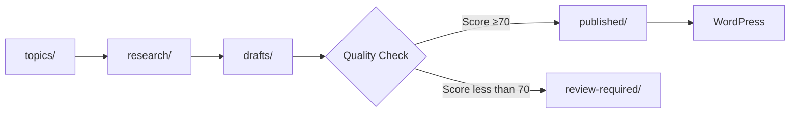

## Overview

SEO Machine provides a structured workflow that takes content from initial idea through research, writing, optimization, and publication. Each stage has specific outputs and quality gates.

## The Content Pipeline

Content flows through distinct stages, each with its own directory:



### Pipeline Stages

| Stage | Directory | Purpose | Commands |
|-------|-----------|---------|----------|
| **Ideas** | `topics/` | Raw content ideas and topics | Manual entry |
| **Research** | `research/` | Research briefs and analysis reports | `/research`, `/analyze-existing` |
| **Writing** | `drafts/` | Work in progress articles | `/write`, `/article` |
| **Review** | `review-required/` | Content needing human review | Automatic routing |
| **Final** | `published/` | Ready-to-publish content | `/optimize` |
| **Updates** | `rewrites/` | Updated existing content | `/rewrite` |
| **Landing** | `landing-pages/` | Landing page content | `/landing-write` |
| **Audits** | `audits/` | Content audit reports | `/analyze-existing` |

## Workflow 1: Creating New Content

### Step 1: Capture Ideas

Add topic ideas to `topics/` directory:

```markdown
# Content Ideas

- Podcast marketing strategies for B2B
- How to monetize a podcast
- Best podcast hosting platforms comparison
```

**Purpose:** Build a content backlog for planning

### Step 2: Research

Run comprehensive keyword and competitive research:

```bash
/research podcast marketing strategies
```

**What happens:**

1. Identifies primary and secondary keywords
2. Analyzes top 10 SERP competitors
3. Identifies content gaps and opportunities
4. Reviews related content in internal-links-map.md
5. Creates recommended outline
6. Generates research brief

**Output:** `research/brief-podcast-marketing-strategies-2026-03-04.md`

**Research Brief Contains:**

<Accordion title="Research Brief Structure">
- SEO Foundation (keywords, volume, difficulty)
- Competitive Landscape (top competitors, common themes)
- Recommended Outline (H1, H2, H3 structure)
- Supporting Elements (statistics, examples, quotes)
- Internal Linking Strategy (3-5 specific pages to link)
- External Sources (2-3 authoritative sites to reference)
- Differentiation Angle (how to stand out)
- Meta Elements Preview (title, description options)
</Accordion>

### Step 3: Write

Create comprehensive, SEO-optimized article:

```bash
/write podcast marketing strategies
```

**What happens:**

1. Reads context files (brand-voice, style-guide, seo-guidelines)
2. Reviews research brief if available
3. Generates 2000-3000+ word article
4. Includes internal and external links
5. Creates meta elements
6. Saves to `drafts/`
7. **Automatically invokes scrubber** to remove AI watermarks
8. **Automatically triggers 5 optimization agents**

**Output Files:**

- `drafts/podcast-marketing-strategies-2026-03-04.md` - Main article
- `drafts/content-analysis-podcast-marketing-strategies-2026-03-04.md` - Comprehensive analysis
- `drafts/seo-report-podcast-marketing-strategies-2026-03-04.md` - SEO recommendations
- `drafts/meta-options-podcast-marketing-strategies-2026-03-04.md` - Meta title/description variations
- `drafts/link-suggestions-podcast-marketing-strategies-2026-03-04.md` - Internal linking opportunities
- `drafts/keyword-analysis-podcast-marketing-strategies-2026-03-04.md` - Keyword placement map

**Automatic Content Scrubbing:**

Immediately after saving, the `/scrub` command automatically runs to remove:

- Invisible Unicode watermarks
- Zero-width spaces and format-control characters
- Excessive em-dashes (replaced with contextual punctuation)
- AI signature patterns

**Automatic Agent Execution:**

Five agents analyze the content in sequence:

<Steps>
  <Step title="Content Analyzer">
    Runs 5 Python modules to analyze search intent, keyword density, content length vs competitors, readability scores, and SEO quality (0-100)
  </Step>
  <Step title="SEO Optimizer">
    Reviews on-page SEO elements, keyword placement, content structure, links, and provides specific improvement recommendations
  </Step>
  <Step title="Meta Creator">
    Generates 5 variations each of meta titles and descriptions with recommendations
  </Step>
  <Step title="Internal Linker">
    Identifies 3-5 strategic internal linking opportunities with exact placement and anchor text
  </Step>
  <Step title="Keyword Mapper">
    Maps keyword distribution, checks density, identifies gaps, and provides specific revision suggestions
  </Step>
</Steps>

### Step 4: Review Agent Feedback

Read all agent reports and prioritize improvements:

1. **Start with Content Analyzer** - Get overall publishing readiness
2. **Review Critical Issues** - Fix any blocking problems
3. **Implement Quick Wins** - Apply high-impact, low-effort improvements
4. **Address Strategic Improvements** - Make deeper content enhancements

### Step 5: Quality Loop

The write command automatically scores content quality:

**Scoring Dimensions** (composite must be ≥70):

| Dimension | Weight | Target |
|-----------|--------|--------|
| Humanity/Voice | 30% | No AI phrases, use contractions |
| Specificity | 25% | Concrete examples, numbers, names |
| Structure Balance | 20% | 40-70% prose (not all lists) |
| SEO Compliance | 15% | Keywords, meta, structure |
| Readability | 10% | Flesch 60-70, grade 8-10 |

**Automatic Routing:**

- **Score ≥70:** Article stays in `drafts/`, proceed to optimization
- **Score less than 70:** Article moves to `review-required/` with `_REVIEW_NOTES.md`

**Review Notes Include:**

- Final composite score
- Dimension breakdown
- Priority fixes needed
- Reason for human review

### Step 6: Optimize

Final SEO polish pass before publishing:

```bash
/optimize drafts/podcast-marketing-strategies-2026-03-04.md
```

**What happens:**

1. Comprehensive SEO audit
2. Validates all elements meet requirements
3. Provides final polish recommendations
4. Generates publishing readiness score
5. Creates optimization report

**Output:** `drafts/optimization-report-podcast-marketing-strategies-2026-03-04.md`

**When content is ready:** Move from `drafts/` to `published/`

### Step 7: Publish (Optional)

Publish directly to WordPress:

```bash
/publish-draft published/podcast-marketing-strategies-2026-03-04.md
```

**What happens:**

1. Reads WordPress credentials from `.env`
2. Converts markdown to WordPress blocks
3. Sets Yoast SEO metadata
4. Publishes via REST API
5. Returns published URL

## Workflow 2: Updating Existing Content

### Step 1: Analyze

Evaluate existing content for improvement opportunities:

```bash
/analyze-existing https://yoursite.com/blog/podcast-equipment
```

**What happens:**

1. Fetches current content
2. Evaluates SEO performance
3. Identifies outdated information
4. Assesses competitive positioning
5. Provides content health score (0-100)
6. Recommends update priority and scope

**Output:** `research/analysis-podcast-equipment-2026-03-04.md`

**Analysis Contains:**

<Accordion title="Content Analysis Structure">
- Content Health Score (0-100)
- Update Priority (low/medium/high/critical)
- Update Scope (minor refresh/moderate update/major rewrite)
- Quick Wins (immediate improvements)
- Strategic Improvements (deeper changes)
- Competitive Gaps (what competitors cover that you don't)
- SEO Issues (technical problems)
- Research Brief for Rewrite (keywords, outline, strategy)
</Accordion>

### Step 2: Rewrite

Update content based on analysis findings:

```bash
/rewrite podcast equipment
```

**What happens:**

1. Reads analysis report
2. Fetches original content if URL provided
3. Updates statistics and examples
4. Fills content gaps
5. Improves SEO optimization
6. Tracks changes made
7. Saves to `rewrites/`

**Output:** `rewrites/podcast-equipment-rewrite-2026-03-04.md`

**Rewrite Includes:**

- Updated article content
- Change summary (what was modified)
- Before/after comparison
- Updated SEO elements

### Step 3: Optimize & Publish

Follow same optimization and publishing process as new content.

## Workflow 3: Quick Article Creation

Simplified workflow for experienced users:

```bash
/article podcast monetization
```

**What happens:**

1. Combines research and writing in one step
2. Creates article with automatic optimization
3. Generates all agent reports
4. Saves to `drafts/`

**Best for:** Topics you already understand well, minor content additions, time-sensitive content

## Workflow 4: Landing Pages

### Research & Write

```bash
/landing-research podcast hosting platforms
/landing-write podcast hosting platforms
```

**What happens:**

1. Analyzes competitor landing pages
2. Identifies conversion best practices
3. Creates conversion-optimized copy
4. Includes CTA strategy
5. Applies CRO best practices

**Output:** `landing-pages/podcast-hosting-platforms-2026-03-04.md`

### Audit & Optimize

```bash
/landing-audit landing-pages/podcast-hosting-platforms-2026-03-04.md
```

**What happens:**

1. Runs 6 CRO analysis modules
2. Evaluates above-the-fold, CTAs, trust signals
3. Provides CRO score (0-100)
4. Generates A/B testing recommendations
5. Creates priority action list

**Output:** `landing-pages/cro-analysis-podcast-hosting-platforms-2026-03-04.md`

### Publish

```bash
/landing-publish landing-pages/podcast-hosting-platforms-2026-03-04.md
```

## Quality Gates

### Automatic Quality Checks

Content must pass quality checks at each stage:

**After Writing:**

- Composite quality score ≥70
- Minimum 2000 words
- Primary keyword density 1-2%
- 3-5 internal links
- 2-3 external links
- Proper heading hierarchy

**Before Publishing:**

- SEO score ≥70/100
- All critical issues resolved
- Meta title 50-60 characters
- Meta description 150-160 characters
- Readability 8th-10th grade level

### Manual Review Triggers

Content moves to `review-required/` when:

- Quality score less than 70 after 2 revision attempts
- Critical SEO issues remain
- Content contains potential inaccuracies
- Tone doesn't match brand voice
- Keyword stuffing detected

## Best Practices

### Do's

<Check>**Always run /research before /write** - Better briefs = better content</Check>
<Check>**Review all agent reports** - They contain actionable improvements</Check>
<Check>**Address critical issues first** - Don't optimize until basics are correct</Check>
<Check>**Use quality loop** - Let automatic scoring guide revisions</Check>
<Check>**Keep context files updated** - Current guidelines = consistent quality</Check>

### Don'ts

<Warning>**Don't skip research** - You'll miss keyword opportunities and content gaps</Warning>
<Warning>**Don't ignore agent feedback** - Data-driven insights improve rankings</Warning>
<Warning>**Don't publish with score less than 70** - Quality threshold exists for a reason</Warning>
<Warning>**Don't force keywords** - Natural integration ranks better than stuffing</Warning>
<Warning>**Don't forget internal links** - They boost SEO and user engagement</Warning>

## Time Estimates

| Workflow | Time Required |
|----------|---------------|
| Research | 10-15 minutes |
| Write (new article) | 5-10 minutes (automatic) |
| Review agent reports | 10-15 minutes |
| Implement improvements | 20-30 minutes |
| Optimize | 5-10 minutes |
| Total (new content) | **50-80 minutes** |
| Analyze existing | 5-10 minutes |
| Rewrite | 5-10 minutes (automatic) |
| Total (update) | **30-50 minutes** |

## Workflow Variations

### Batch Content Creation

Research multiple topics, then write in batch:

```bash
/research topic 1
/research topic 2
/research topic 3
# Review all briefs, then:
/write topic 1
/write topic 2
/write topic 3
```

### Data-Driven Prioritization

Use analytics to prioritize content work:

```bash
/performance-review  # Get priority content tasks
/priorities          # Content prioritization matrix
/research-performance  # Performance-based opportunities
```

### Content Refresh Audit

Audit multiple articles to plan updates:

```bash
/analyze-existing https://yoursite.com/post-1
/analyze-existing https://yoursite.com/post-2
/analyze-existing https://yoursite.com/post-3
# Review health scores, prioritize rewrites
```

<Info>
The workflow is flexible - adapt it to your needs while maintaining quality standards at each stage.
</Info>